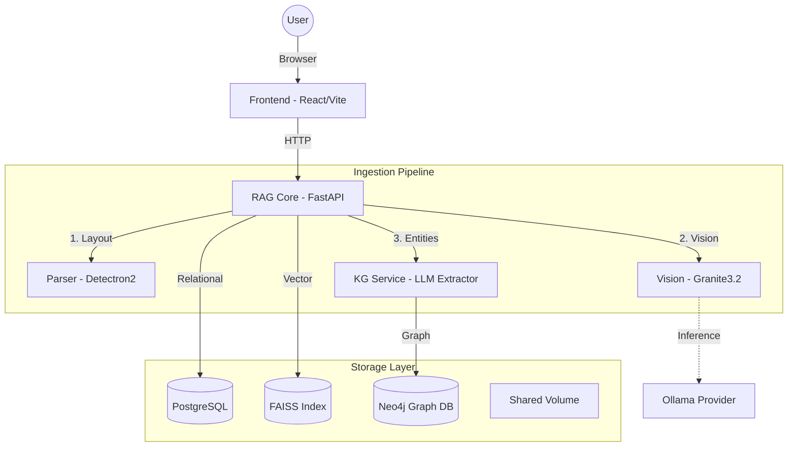

# 🧠 AIRBud 2.0 Document Analyzer

**An enterprise-grade, visual-first RAG system featuring GraphRAG, Computer Vision, and Hybrid Search.**

Unlike traditional RAG systems that only match text keywords, AIRBud 2.0 combines **Computer Vision** (to read charts), **Knowledge Graphs** (to understand relationships), and **Vector Search** (for semantic similarity).

---

## 🏗 High-Level Architecture

The system uses a Microservices architecture orchestrated by Docker Compose.



---

## 🧩 Technology Stack

| Service        | Tech                                  | Role                                                                                 |
| :------------- | :------------------------------------ | :----------------------------------------------------------------------------------- |
| **Frontend**   | React, Tailwind, Recharts, ForceGraph | Modern UI for chat, document management, and graph visualization.                    |
| **RAG Core**   | FastAPI, LangChain, FAISS             | Orchestrator. Handles embedding, hybrid search logic, and DB management.             |
| **KG Service** | FastAPI, [Neo4j](https://neo4j.com)   | **GraphRAG**. Extracts entities/relationships and performs 2-hop neighbor retrieval. |
| **Parser**     | Detectron2, PyMuPDF                   | Layout Analysis. Detects and crops tables/figures from PDFs.                         |
| **Vision**     | PyTorch, Transformers                 | Runs local VLMs Granite3.2 to transcribe charts into text.     |
| **Database**   | PostgreSQL 15                         | Stores collection metadata, chat history, and raw text chunks.                       |

---

## 🚀 Features

### 1. GraphRAG (Knowledge Graph)

We use **Neo4j** to build a semantic graph of your documents.

- **Extraction:** An LLM scans your text to identify entities (People, Places, Concepts) and how they connect.
- **Visualization:** Interactive 2D Force-Directed Graph explorer to see connections in your data.
- **Hybrid Search:** Queries combine Vector Similarity + Graph Traversal for deeper answers.

### 2. Intelligent Chart Browser

The system "looks" at your documents using Computer Vision.

- **Detection:** Detectron2 identifies charts, graphs, and tables.
- **Analysis:** Vision Models Granite generate detailed textual descriptions of data trends.
- **Retrieval:** You can search for data points hidden inside images.

### 3. Collections Management

Organize research into **Collections** (folders). You can add or remove documents dynamically, and the Knowledge Graph updates automatically to reflect the current state of the collection.

### 4. Parent-Child Chunking

We use a **Parent-Child** retrieval strategy:

- **Child Chunks:** Small, specific text fragments used for high-precision vector search.
- **Parent Chunks:** Larger context blocks returned to the LLM to ensure the answer is comprehensive.

---

## 📂 Project Structure

```text
.
├── docker-compose.yml          # Main orchestration
├── .env                        # Config & API Keys
├── data/                       # Persistent Volumes
│   ├── uploads/                # Raw files
│   ├── charts/                 # Extracted images
│   ├── faiss_indexes/          # Vector indices
│   ├── neo4j_data/             # Graph DB storage
│   └── postgres_data/          # SQL DB storage
└── services/
    ├── frontend/               # React UI
    ├── rag_core/               # Main Logic & Vector Search
    ├── kg_service/             # Neo4j & Graph Extraction
    ├── parser/                 # Document Layout Analysis
    └── vision/                 # Image Inference
```

---

## ⚡️ Quick Start

### 1. Configure `.env`:

```ini
GROQ_API_KEY=your_key
SANCTUARY_API_KEY=your_key
```

### 2. Choose Your Deployment Mode:

The system supports two primary modes of operation controlled by separate Docker Compose files.

#### A. Local Development (Mac/CPU + CAC Auth)
Use this mode for running on a MacBook or local environment. It includes **CAC Certificate Authentication** in Nginx.

```bash
docker-compose up -d --build
```
- **Auth:** Requires a client certificate (CAC).
- **GPU:** Uses CPU for inference.
- **Port:** [https://localhost](https://localhost) (Self-signed cert).

#### B. Deployed Mode (Linux + GPU + Non-CAC)
Use this mode for deployment on a Linux server with an NVIDIA GPU (e.g., Tesla T4). It **disables CAC logic** for easier access and enables CUDA acceleration.

```bash
docker-compose -f docker-compose.deployed.yml up -d --build
```
- **Auth:** Standard HTTPS (CAC verification disabled).
- **GPU:** Utilizes NVIDIA CUDA for `vision` and `rag_core`.
- **Port:** [https://localhost](https://localhost).

### 3. Access the App:
- **Frontend:** [https://localhost](https://localhost)
- **Neo4j Browser:** [http://localhost:7474](http://localhost:7474) (User: `neo4j`, Pass: `${NEO4J_PASSWORD}`)

