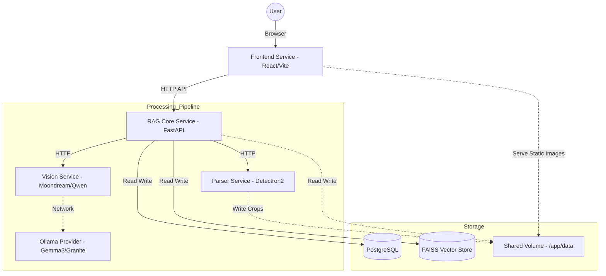

# 🧠 Smart RAG Document Analyzer (Microservices Architecture)

**An enterprise-grade, visual-first RAG system designed to understand charts, tables, and layouts in complex documents.**

Unlike traditional RAG systems that only read text, Smart RAG uses computer vision and object detection to identify, crop, and analyze visual elements (charts, slides, diagrams) using state-of-the-art Vision Language Models (VLMs) before indexing.

---

## 🏗 High-Level Architecture

The system is split into specialized microservices to ensure scalability, modularity, and hardware efficiency.



---

## 🧩 Microservices Breakdown

| Service | Technology | Description |
| :--- | :--- | :--- |
| **Frontend** | React, Vite, Tailwind, Shadcn UI | A modern, responsive dashboard for managing collections, uploading files, and visualizing data. |
| **RAG Core** | FastAPI, LangChain, FAISS | The "Brain". Handles orchestration, embedding generation, vector storage, and **PostgreSQL** metadata management. |
| **Parser** | Detectron2, PyMuPDF | The "Eyes". Converts PDFs/Docs to images and runs **PubLayNet** to detect tables/figures for cropping. |
| **Vision** | PyTorch, Transformers | The "Visual Cortex". Runs local VLMs (Moondream2, Qwen-VL, InternVL) to generate text descriptions of charts. |
| **Ollama** | Ollama | The "Heavy Lifter". Runs larger reasoning models (Gemma 3, Granite Vision) via API for complex tasks. |
| **Postgres** | PostgreSQL 15 | Relational storage for Collections, Documents, and Chat History. |

---

## 🚀 Getting Started

### Prerequisites

*   **Docker & Docker Compose**
*   **API Keys:**
    *   **Groq API Key:** For high-speed text generation (Llama 3/4) in Test Mode.
    *   **Sanctuary API Key:** For production LLM usage (Claude 3.5 Sonnet).
*   **Ollama:**
    *   *Mac/Dev:* Install the [Ollama Desktop App](https://ollama.com).
    *   *Linux/Prod:* Docker handles the Ollama container automatically.

### 1. Configuration (`.env`)

Create a `.env` file in the root directory:

```ini
# API Keys
GROQ_API_KEY=your_groq_api_key_here
SANCTUARY_API_KEY=your_sanctuary_key_here

# Environment Mode
# "True" = Mac/Local Dev (Uses CPU, Local Ollama, Groq Llama)
# "False" = Linux/Prod (Uses NVIDIA GPU, Docker Ollama, Claude 3.5)
TEST=True
```

### 2. Running Locally (Mac M-Series / Dev)

In this mode, the system runs lightweight services in Docker and offloads heavy AI inference to your Mac's native NPU/GPU via the host Ollama app.

1.  **Configure Local Ollama:**
    Docker needs permission to access your Mac's Ollama. Run this in your terminal:
    ```bash
    launchctl setenv OLLAMA_HOST "0.0.0.0"
    ```
    *Restart the Ollama app after running this.*

2.  **Pull Vision Models:**
    ```bash
    ollama pull gemma3
    ollama pull granite3.2-vision
    ```

3.  **Start the System:**
    ```bash
    # Passing TEST=True allows the frontend to show the correct model info
    TEST=True docker-compose up --build
    ```

4.  **Access the App:** Open **http://localhost:5173**

### 3. Running in Production (Linux + NVIDIA GPU)

In this mode, Docker manages everything, including the Ollama instance, and maps the NVIDIA GPU to the containers.

1.  **Set Environment:**
    Change `TEST=False` in your `.env` file.

2.  **Start with GPU Overrides:**
    ```bash
    docker-compose -f docker-compose.yml -f docker-compose.prod.yml up --build -d
    ```

---

## 🛠 Features

### 1. Collections Management
Organize your research into **Collections**. Unlike static sessions, Collections are mutable workspaces where you can:
*   Add new documents over time.
*   Remove outdated documents.
*   Chat with the aggregate context of the entire folder.

### 2. Intelligent Chart Browser
The system automatically detects, crops, and analyzes visual elements.
*   **Visual Analysis:** Every chart is passed through a Vision Model to extract trends, axis labels, and data points.
*   **Searchable:** These descriptions are embedded, meaning you can search for "Sales trend in Q3" and retrieve a chart image even if the text didn't explicitly mention it.

### 3. Parent-Child Chunking
We use a **Parent-Child** retrieval strategy:
*   **Child Chunks:** Small, specific text fragments used for high-precision vector search.
*   **Parent Chunks:** Larger context blocks (pages or paragraphs) returned to the LLM to ensure the answer is comprehensive and accurate.

### 4. Hybrid Search Architecture
*   **FAISS:** Used for dense vector similarity search.
*   **PostgreSQL:** Used for structured filtering, history management, and relational mapping between Charts, Documents, and Collections.

---

## 📂 Project Structure

```text
.
├── docker-compose.yml          # Base config (CPU/Mac compatible)
├── docker-compose.prod.yml     # Production overrides (GPU support)
├── .env                        # Secrets and Config
├── data/                       # Mapped volume
│   ├── uploads/                # Raw PDFs/Docx
│   ├── charts/                 # Extracted images
│   ├── faiss_indexes/          # Vector stores
│   └── chunks/                 # Serialized text chunks
└── services/
    ├── frontend/               # React + Vite Application
    │   ├── src/                # Components, Pages, API Logic
    │   └── Dockerfile
    ├── rag_core/               # FastAPI Orchestrator
    │   ├── src/core/           # Pipeline, Chunking, LLM Clients
    │   ├── src/utils/          # DB Connection Pooling
    │   └── Dockerfile
    ├── parser/                 # Document Parsing Service
    │   ├── src/core/           # Detectron2 & PyMuPDF Logic
    │   └── Dockerfile
    └── vision/                 # Vision Inference Service
        ├── src/core/           # Model Manager (Moondream/Qwen)
        └── Dockerfile
```

---

## 🔧 Troubleshooting

**"Ollama connection failed"**
*   *Mac:* Ensure you ran `launchctl setenv OLLAMA_HOST "0.0.0.0"` and restarted the Ollama app.
*   *Linux:* Ensure the `ollama` container is running and healthy.

**"Column collection_id does not exist"**
*   If you migrated from an older version, your database schema might be outdated. Run `docker-compose down -v` to wipe the DB volume and restart.

**"Cannot copy out of meta tensor"**
*   Ensure you are using the correct `rag_core` Dockerfile which forces CPU-only PyTorch to prevent `accelerate` from trying to use a non-existent GPU.