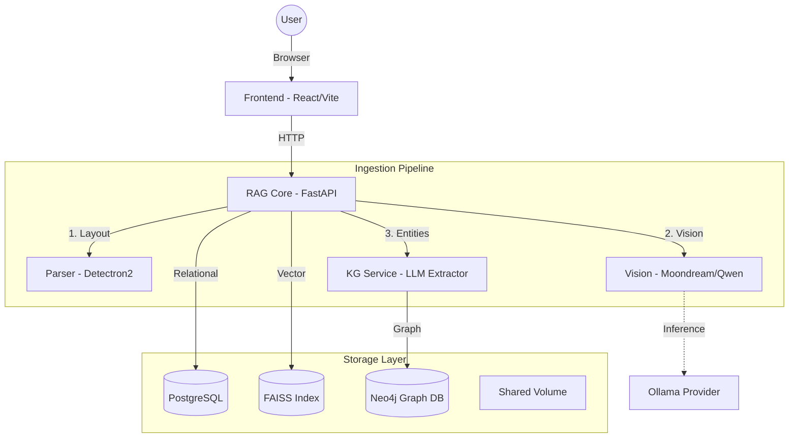

# 🧠 Smart RAG Document Analyzer

**An enterprise-grade, visual-first RAG system featuring GraphRAG, Computer Vision, and Hybrid Search.**

Unlike traditional RAG systems that only match text keywords, Smart RAG combines **Computer Vision** (to read charts), **Knowledge Graphs** (to understand relationships), and **Vector Search** (for semantic similarity).

---

## 🏗 High-Level Architecture

The system uses a Microservices architecture orchestrated by Docker Compose.



---

## 🧩 Technology Stack

| Service | Tech | Role |
| :--- | :--- | :--- |
| **Frontend** | React, Tailwind, Recharts, ForceGraph | Modern UI for chat, document management, and graph visualization. |
| **RAG Core** | FastAPI, LangChain, FAISS | Orchestrator. Handles embedding, hybrid search logic, and DB management. |
| **KG Service** | FastAPI, [Neo4j](https://neo4j.com) | **GraphRAG**. Extracts entities/relationships and performs 2-hop neighbor retrieval. |
| **Parser** | Detectron2, PyMuPDF | Layout Analysis. Detects and crops tables/figures from PDFs. |
| **Vision** | PyTorch, Transformers | Runs local VLMs (Moondream2, Qwen-VL) to transcribe charts into text. |
| **Database** | PostgreSQL 15 | Stores collection metadata, chat history, and raw text chunks. |

---

## 🚀 Features

### 1. GraphRAG (Knowledge Graph)
We use **Neo4j** to build a semantic graph of your documents.
*   **Extraction:** An LLM scans your text to identify entities (People, Places, Concepts) and how they connect.
*   **Visualization:** Interactive 2D Force-Directed Graph explorer to see connections in your data.
*   **Hybrid Search:** Queries combine Vector Similarity + Graph Traversal for deeper answers.

### 2. Intelligent Chart Browser
The system "looks" at your documents using Computer Vision.
*   **Detection:** Detectron2 identifies charts, graphs, and tables.
*   **Analysis:** Vision Models (Moondream/Qwen) generate detailed textual descriptions of data trends.
*   **Retrieval:** You can search for data points hidden inside images.

### 3. Collections Management
Organize research into **Collections** (folders). You can add or remove documents dynamically, and the Knowledge Graph updates automatically to reflect the current state of the collection.

### 4. Parent-Child Chunking
We use a **Parent-Child** retrieval strategy:
*   **Child Chunks:** Small, specific text fragments used for high-precision vector search.
*   **Parent Chunks:** Larger context blocks returned to the LLM to ensure the answer is comprehensive.

---

## 📂 Project Structure

```text
.
├── docker-compose.yml          # Main orchestration
├── .env                        # Config & API Keys
├── data/                       # Persistent Volumes
│   ├── uploads/                # Raw files
│   ├── charts/                 # Extracted images
│   ├── faiss_indexes/          # Vector indices
│   ├── neo4j_data/             # Graph DB storage
│   └── postgres_data/          # SQL DB storage
└── services/
    ├── frontend/               # React UI
    ├── rag_core/               # Main Logic & Vector Search
    ├── kg_service/             # Neo4j & Graph Extraction
    ├── parser/                 # Document Layout Analysis
    └── vision/                 # Image Inference
```

---

## ⚡️ Quick Start

1.  **Configure `.env`**:
    ```ini
    GROQ_API_KEY=your_key
    SANCTUARY_API_KEY=your_key
    TEST=True  # True = Mac/Local (CPU), False = Prod (GPU)
    ```

2.  **Start Services**:
    ```bash
    docker-compose up -d --build
    ```

3.  **Access the App**:
    *   **Frontend:** [http://localhost:5173](http://localhost:5173)
    *   **Neo4j Browser:** [http://localhost:7474](http://localhost:7474) (User: `neo4j`, Pass: `smartrag_password`)
